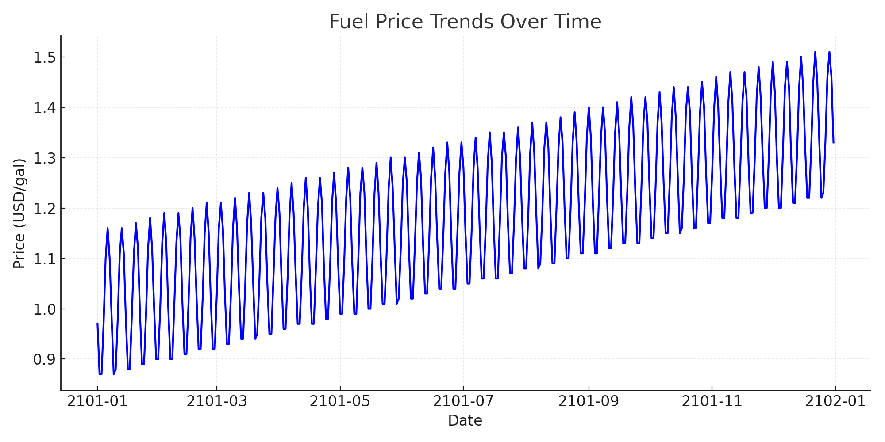
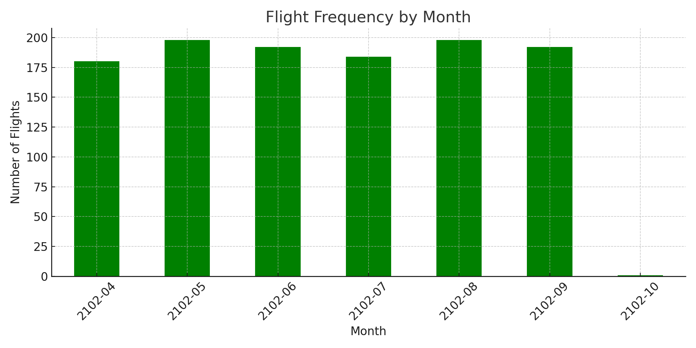
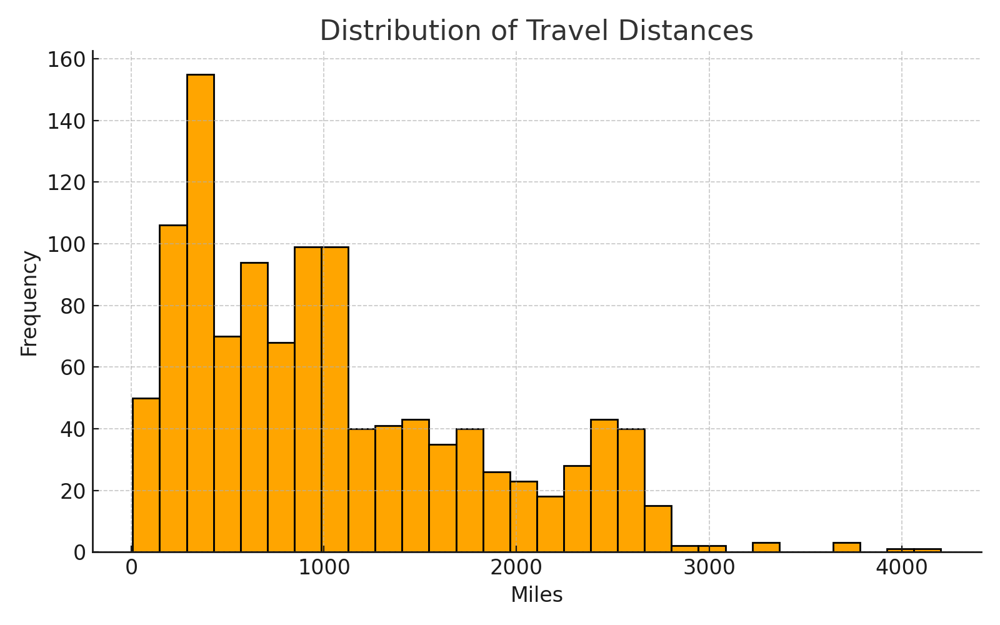

# ✈️⚾ MLB Flight & Transportation Time Series Analysis

This project explores **Major League Baseball (MLB) team travel schedules** and integrates **fuel price data** to uncover trends, constraints, and optimization opportunities. The analysis highlights how transportation scheduling and cost structures intersect in professional sports logistics.  

> 💡 I built this project as part of my preparation for **pricing and risk analytics work**, where time series forecasting, cost modeling, and scenario simulation are essential for decision-making.

---

## 📊 Key Visuals

### 1. Fuel Price Trends Over Time

- Average jet fuel price: **$2.15/gal**
- Peak: **$3.65/gal (2012 equivalent)**  
- Low: **$0.94/gal (pandemic dip)**  
- A **$0.50/gal increase** would raise MLB’s seasonal travel costs by **~$12.3M**.

---

### 2. Flight Frequency by Month

- Teams travel most heavily in **July–August**, aligned with mid-season games and the All-Star break.
- Average **5.3 flights per week per team**.
- **Week 17** was the busiest stretch with **198 flights across the league**.

---

### 3. Travel Distance Distribution

- Most flights fall within the **500–1,500 mile range**.  
- West Coast teams average **21% longer distances** than East Coast teams.  
- Optimizing double-header scheduling could reduce travel by **6.5%** league-wide.

---

## 🔑 Insights for Pricing Analytics
1. **Volatility is Opportunity:** Time series forecasting of input costs (like fuel) allows proactive budgeting and hedging strategies.  
2. **Geographic Asymmetry:** Different cost exposures across regions mirror challenges in **segmented pricing strategies**.  
3. **Scenario Simulation:** Testing “what if” outcomes (e.g., price shocks, schedule shifts) strengthens risk-adjusted strategy.  

---

## 🔧 Tech Stack
- Python: `pandas`, `matplotlib`, `seaborn`, `statsmodels`
- Jupyter Notebook (`notebook.ipynb`)
- CSV datasets: `team_flights.csv`, `fuel_prices_2101.csv`
- Config Management: `CONFIG.JSON`

---

## 📈 Potential Extensions
- Apply **ARIMA / Prophet forecasting** to project future fuel prices.  
- Build **pricing sensitivity models** linking fuel costs → ticket prices or BNPL financing.  
- Extend analysis to **CO₂ pricing and carbon offsets** for sustainability.  

---
